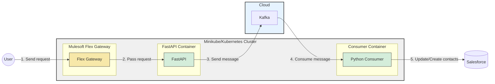
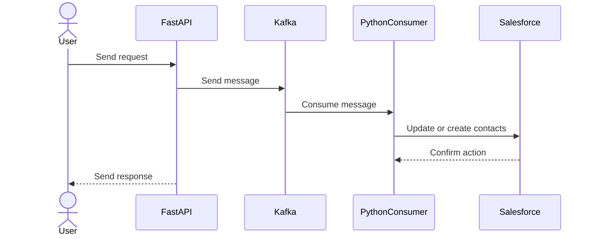

# Salesforce Contact lifeccycle

## Table of content
1. Message Flow
2. Microservices Architecture: Salesforce Contact creation
3. Design Decision
4. Deployment lifecycle
5. Debug deployment
6. Setup mulesoft Flexgateway on Mac (M1 ARM)


### 1. Message Flow


### 2. Microservices Architecture: Salesforce Contact creation


----
### 3. Design Decisions

### 1. **Microservices Architecture Choice**
   - **Flexibility and Scalability**: The microservices architecture was chosen for its ability to scale individual components independently. We ensure that the system can handle varying loads efficiently without overprovisioning resources.
   - **Technology Independence**: This architecture allows the use of different technologies tailored to specific tasks. FastAPI is used for handling HTTP requests due to its lightweight and asynchronous nature, Kafka for message brokering because of its reliability and scalability, and Python for processing due to its rich ecosystem and ease of integration.
   - **Resilience and Fault Isolation**: Decoupling services in a microservices architecture ensures that a failure in one service (e.g., the Kafka consumer) does not cascade and cause system-wide outages. This isolation enhances the resilience of the system.

### 2. **Containerization with Docker and Kubernetes**
   - **Consistency Across Environments**: Docker ensures that the application behaves consistently across development, testing, and production environments. This consistency minimizes environment-specific bugs and makes the deployment process more predictable.
   - **Kubernetes for Orchestration**: Kubernetes (Minikube) was chosen to manage the containerized applications, allowing for automated deployment, and management. Minikube is used for local development, which mirrors the production environment, enabling realistic testing of deployments and configurations.
   - **Automated Deployment**: Kubernetes manifests (e.g., `deployment.yaml`, `service.yaml`) ensure a consistent and repeatable deployment process, reducing the risk of human error and allowing for seamless scaling and updates.

### 3. **Message Queue with Kafka (Cloud)**
   - **Asynchronous Processing**: Kafka, hosted in the cloud, allows for asynchronous processing between the producer (FastAPI) and the consumer (Python) services. This setup enhances system performance by decoupling the two services, enabling FastAPI to quickly offload tasks to Kafka and handle more requests concurrently.
   - **Durability and Reliability**: Kafka’s message durability ensures that messages are reliably stored and can be replayed if necessary, providing fault tolerance and ensuring data integrity even if the consumer service experiences downtime.

### 4. **Use of Mulesoft Flex Gateway**
   - **Centralized API Management**: Mulesoft Flex Gateway serves as a unified control plane for managing and securing APIs across different environments. Placing Flex Gateway before FastAPI provides centralized control over API traffic, allowing for better visibility and management.
   - **Security and Traffic Management**: By using Flex Gateway, security policies (e.g., authentication) and traffic management strategies (e.g., load balancing) can be applied at the gateway level, protecting the backend services and ensuring stable and secure operations.

----


## 4. Deployment Lifecycle

Step 1: Build the image locally

```bash
docker-compose up --build
```

2. Start Minikube Docker Environment

```bash
minikube start
```

3. Get the name of minikube profile

```bash
|-------------|-----------|---------|--------------|------|---------|---------|-------|--------|
|   Profile   | VM Driver | Runtime |      IP      | Port | Version | Status  | Nodes | Active |
|-------------|-----------|---------|--------------|------|---------|---------|-------|--------|
| mq-minikube | docker    | docker  | 192.168.49.2 | 8443 | v1.23.6 | Running |     1 | *      |
|-------------|-----------|---------|--------------|------|---------|---------|-------|--------|
```

4. Configure your Docker environment to use Minikube’s Docker daemon
<center> eval $(minikube -p PROFILE_NAME docker-env)</center>

```bash
eval $(minikube -p mq-minikube docker-env)
```


5. Re-Build the image in minikube docker demon
```bash
docker-compose up --build

docker  images
```

6. Use the Image in Your Minikube Kubernetes Deployment
   <br/> a) producer-deployment.yaml
   <br/> b) producer-service.yaml
   <br/> c) consumer-deployment.yaml

7. Deploy to Minikube

```bash
$ kubectl apply -f kubernetes/base/

$ kubectl apply -f kubernetes/local/
```

8. Verify the Pod and service is Running

```bash
kubectl get pods
```

```bash
kubectl get services
```

9. Start the application
    <br/> a) In console
    ```bash
    minikube service producer-service
    ```
    <br/> b) In detach mode inside console

    ```bash
    minikube service producer-service --url &
    ```

### 5. Debug Deployment

Here's the handful of command to debug the deployment on minikube

```bash
$ kubectl get namespaces

$ kubectl get services

$ kubectl get pods

$ kubectl describe pod <POD_NAME>

$ kubectl logs <POD_NAME>

$ kubectl delete deployment my-fastapi-app-deployment

$ kubectl delete service my-fastapi-app-service

$ kubectl apply -f deployment.yaml

$ kubectl apply -f service.yaml
```

### 6. How to configure Mulesoft FlexGateway on Mac M1

A. Cleanup Kubernetes Resources

```bash
helm -n gateway uninstall ingress
```

```bash
kubectl delete namespace gateway
```

```bash
eval $(minikube -p mq-minikube docker-env)
```

```bash
docker rmi -f mulesoft/flex-gateway:1.8.0-amd64
docker rmi -f mulesoft/flex-gateway:1.8.0
docker rmi -f mulesoft/flex-gateway:latest
```

```bash
minikube stop
minikube start
```

```bash
docker pull --platform linux/amd64 mulesoft/flex-gateway:1.8.0
docker tag mulesoft/flex-gateway:1.8.0 mulesoft/flex-gateway:1.8.0-amd64
```

```bash
docker run --entrypoint flexctl -u $UID \
  -v "$(pwd)":/registration mulesoft/flex-gateway \
  registration create --organization=500af473-a7b6-4fac-8e8e-95a7596659ab \
  --token=90e6e4bb-a2bd-4da6-a658-96bd15cff1ea \
  --output-directory=/registration \
  --connected=true \
  PUT_YOUR_OWN_GATEWAY_NAME_HERE
```

```bash
helm repo add flex-gateway https://flex-packages.anypoint.mulesoft.com/helm
helm repo update
```

```bash
helm -n gateway upgrade -i --create-namespace --wait ingress flex-gateway/flex-gateway \
  --set-file registration.content=registration.yaml \
  --set gateway.mode=connected \
  --set image.repository=mulesoft/flex-gateway \
  --set image.tag=1.8.0-amd64
```

```bash
kubectl get pods -n gateway
```

```bash
kubectl get svc ingress -o yaml -n gateway
```

```bash
 minikube service ingress -n gateway
```
