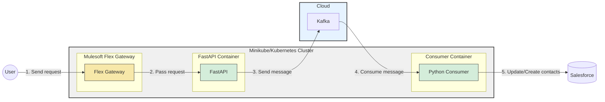
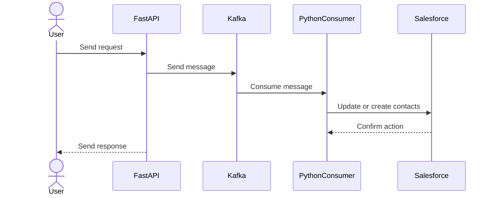

# Table of content
1. Message Flow
2. Microservices Architecture: Salesforce Contact creation
3. Deployment lifecycle
4. Debug deployment
5. Setup mulesoft Flexgateway on Mac (M1 ARM)


## 1. Message Flow


## 2. Microservices Architecture: Salesforce Contact creation



## 3. Deployment Lifecycle

Step 1: Build the image locally

```bash
docker-compose up --build
```

2. Start Minikube Docker Environment

```bash
minikube start
```

3. Get the name of minikube profile

```bash
|-------------|-----------|---------|--------------|------|---------|---------|-------|--------|
|   Profile   | VM Driver | Runtime |      IP      | Port | Version | Status  | Nodes | Active |
|-------------|-----------|---------|--------------|------|---------|---------|-------|--------|
| mq-minikube | docker    | docker  | 192.168.49.2 | 8443 | v1.23.6 | Running |     1 | *      |
|-------------|-----------|---------|--------------|------|---------|---------|-------|--------|
```

4. Configure your Docker environment to use Minikube’s Docker daemon
<center> eval $(minikube -p PROFILE_NAME docker-env)</center>

```bash
eval $(minikube -p mq-minikube docker-env)
```


5. Re-Build the image in minikube docker demon
```bash
docker-compose up --build

docker  images
```

6. Use the Image in Your Minikube Kubernetes Deployment
   <br/> a) producer-deployment.yaml
   <br/> b) producer-service.yaml
   <br/> c) consumer-deployment.yaml

7. Deploy to Minikube

```bash
$ kubectl apply -f kubernetes/base/

$ kubectl apply -f kubernetes/local/
```

8. Verify the Pod and service is Running

```bash
kubectl get pods
```

```bash
kubectl get services
```

9. Start the application
    <br/> a) In console
    ```bash
    minikube service producer-service
    ```
    <br/> b) In detach mode inside console

    ```bash
    minikube service producer-service --url &
    ```

### 4. Debug Deployment

Here's the handful of command to debug the deployment on minikube

```bash
$ kubectl get namespaces

$ kubectl get services

$ kubectl get pods

$ kubectl describe pod <POD_NAME>

$ kubectl logs <POD_NAME>

$ kubectl delete deployment my-fastapi-app-deployment

$ kubectl delete service my-fastapi-app-service

$ kubectl apply -f deployment.yaml

$ kubectl apply -f service.yaml
```

### 5. How to configure Mulesoft FlexGateway on Mac M1

A. Cleanup Kubernetes Resources

```bash
helm -n gateway uninstall ingress
```

```bash
kubectl delete namespace gateway
```

```bash
eval $(minikube -p mq-minikube docker-env)
```

```bash
docker rmi -f mulesoft/flex-gateway:1.8.0-amd64
docker rmi -f mulesoft/flex-gateway:1.8.0
docker rmi -f mulesoft/flex-gateway:latest
```

```bash
minikube stop
minikube start
```

```bash
docker pull --platform linux/amd64 mulesoft/flex-gateway:1.8.0
docker tag mulesoft/flex-gateway:1.8.0 mulesoft/flex-gateway:1.8.0-amd64
```

```bash
docker run --entrypoint flexctl -u $UID \
  -v "$(pwd)":/registration mulesoft/flex-gateway \
  registration create --organization=500af473-a7b6-4fac-8e8e-95a7596659ab \
  --token=90e6e4bb-a2bd-4da6-a658-96bd15cff1ea \
  --output-directory=/registration \
  --connected=true \
  PUT_YOUR_OWN_GATEWAY_NAME_HERE
```

```bash
helm repo add flex-gateway https://flex-packages.anypoint.mulesoft.com/helm
helm repo update
```

```bash
helm -n gateway upgrade -i --create-namespace --wait ingress flex-gateway/flex-gateway \
  --set-file registration.content=registration.yaml \
  --set gateway.mode=connected \
  --set image.repository=mulesoft/flex-gateway \
  --set image.tag=1.8.0-amd64
```

```bash
kubectl get pods -n gateway
```

```bash
kubectl get svc ingress -o yaml -n gateway
```

```bash
 minikube service ingress -n gateway
```
